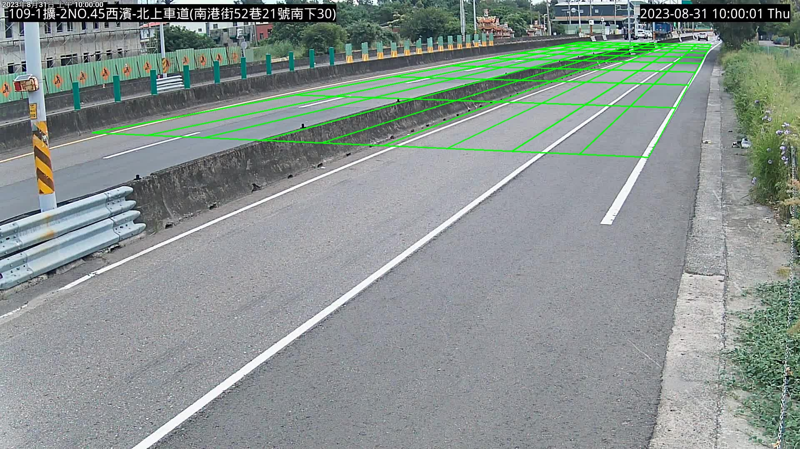

# Image to World Transformation Demo
This repository demonstrates the transformation between 2D image coordinates and 3D world coordinates using a homography matrix.

## Environment setup
```
conda create -n image_to_world python==3.8 -y
conda activate image_to_world
pip install -r requirements.txt
```
## Data preparation
Please modify the coordinate files in the coord folder. (1) image_coordinate.txt and world_coordinate.txt should contain corresponding matching 2D and 3D coordinates, at least four points need to be in each file in order to get the homography matrix. (2) ground_corners.txt should contain four world coordinates representing the bottom left, bottom right, upper right, and upper left of ground plane. 
## To run the code:
To run the code without using any sampling from your annotated coordinates
```
python main.py --img_path path/to/your/image.jpg --verbose --save_path output_image.jpg
```
To run the code using random sampling from your annotated coordinates.  
This command will provide 5 different results with randomly removing 2 of the annotated coordinates.
```
python main.py --img_path path/to/your/image.jpg --trial_number 5 --remove_number 2 -verbose --save_path output_image.jpg
```

